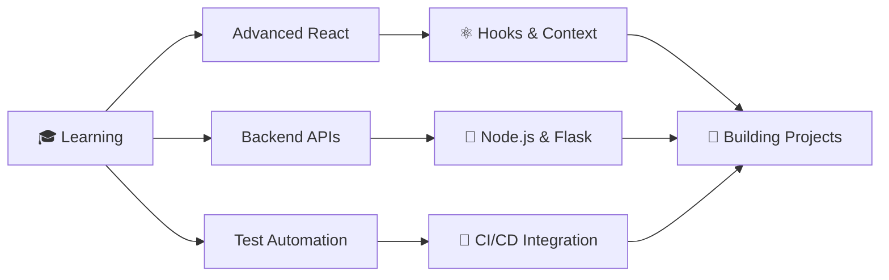

<div align="center">

# 👋 Hi there, I'm Sai Prakash!


[](https://github.com/saiprakash0506)
[](https://github.com/saiprakash0506)
[](https://github.com/saiprakash0506)

</div>

---

## 🚀 About Me

```javascript
const saiPrakash = {
    pronouns: "He" | "Him",
    location: "India 🇮🇳",
    currentRole: "Full-Stack Developer & Test Automation Engineer",
    education: "Wipro 2026 Training Program",
    askMeAbout: ["Web Dev", "Test Automation", "API Development", "React", "Python"],
    technologies: {
        frontEnd: {
            languages: ["JavaScript", "HTML5", "CSS3"],
            frameworks: ["React.js", "Bootstrap"],
            design: ["Responsive Design", "UI/UX"]
        },
        backEnd: {
            languages: ["Python", "Node.js"],
            databases: ["MongoDB"],
            api: ["REST API", "Flask"]
        },
        testing: {
            frameworks: ["Selenium WebDriver", "Pytest", "Robot Framework"],
            tools: ["Postman", "Selenium IDE"],
            types: ["Unit Testing", "Integration Testing", "E2E Testing", "API Testing"]
        },
        tools: ["Git", "GitHub", "VS Code", "Chrome DevTools"],
        currentlyLearning: ["Advanced React Patterns", "CI/CD", "Docker"]
    },
    funFact: "I learn best by building clones of popular applications! 🎨"
};
```

---

## 💻 Tech Stack

<div align="center">

### 🎨 Frontend Development


### ⚙️ Backend Development


### 🧪 Testing & Automation


### 🛠️ Tools & Platforms


</div>

---

## 🏆 GitHub Trophies

<div align="center">


</div>

---

## 📊 GitHub Statistics

<div align="center">
  


</div>

<div align="center">
  


</div>

<div align="center">


</div>

---

## 🌟 Featured Projects

<div align="center">

### 🔥 Highlighted Work

</div>

<table>
<tr>
<td width="50%">

### 📅 [Calendar Application](https://github.com/saiprakash0506/Calendar-Application-for-Communication-Tracking-ENTNT)
**React-based Communication Tracker**


A comprehensive calendar application featuring:
- 🎯 Admin & User modules
- 📊 Communication tracking
- 📈 Detailed reporting
- 🎨 Modern UI/UX

</td>
<td width="50%">

### 🎓 [Wipro 2026 Training](https://github.com/saiprakash0506/Wipro2k26_training)
**Complete Test Automation Portfolio**


Comprehensive automation training including:
- 🧪 Selenium WebDriver mastery
- 🤖 Robot Framework expertise
- ✅ API testing with Pytest
- 📝 3 complete case studies

</td>
</tr>

<tr>
<td width="50%">

### 💰 [Python Banking System](https://github.com/saiprakash0506/PYTHON-BANKING-SYSTEM)
**Comprehensive Banking Simulation**


Full-featured banking system with:
- 💳 Account management
- 💸 Transactions & transfers
- 📊 Transaction history
- 🔐 Secure operations

</td>
<td width="50%">

### 🌤️ [WeatherBot](https://github.com/saiprakash0506/WeatherBot-Real-Time-Weather-Updates-via-Telegram-and-Web-Browser)
**Multi-Platform Weather Service**


Dual-interface weather updates:
- 🤖 Telegram bot integration
- 🌐 Web browser interface
- 🌍 Real-time API data
- 📍 Location-based forecasts

</td>
</tr>

<tr>
<td width="50%">

### 🎵 [Spotify Clone](https://github.com/saiprakash0506/SpotifyClone)
**Pixel-Perfect Web Player**


Feature-rich music player clone:
- 🎨 Responsive design
- 🎧 Music controls
- 📱 Mobile-friendly
- 🎼 Playlist management

</td>
<td width="50%">

### ✅ [TaskMaster](https://github.com/saiprakash0506/TaskMaster-A-Secure-To-Do-List-App)
**Secure Task Management**


Efficient productivity tool:
- ✨ Clean, intuitive UI
- 🔒 Secure data handling
- 📋 Task organization
- ⚡ Fast performance

</td>
</tr>

<tr>
<td width="50%">

### 🍽️ [Recipe Finder](https://github.com/saiprakash0506/RECIPE-FINDER)
**Interactive Recipe Search**


Smart recipe discovery:
- 🔍 Ingredient-based search
- 🍳 API integration
- 📱 Responsive interface
- 🎨 Modern design

</td>
<td width="50%">

### 🎮 [Rock Paper Scissors](https://github.com/saiprakash0506/ROCK-PAPER-SCISSORS-GAME-USING-JAVASCRIPT)
**Interactive Browser Game**


Classic game reimagined:
- 🎯 Smart AI opponent
- 🎨 Dynamic UI
- 🏆 Score tracking
- 📱 Cross-platform (JS & Python)

</td>
</tr>

</table>

---

## 🎯 Current Focus

<div align="center">



</div>

### 🔭 Currently Working On
- 🎓 **Wipro 2026 Training** - Advanced test automation concepts
- ⚛️ **React Projects** - Building scalable applications
- 🧪 **Automation Frameworks** - Creating reusable test suites
- 🌐 **Full-Stack Projects** - End-to-end application development

### 🌱 Learning Goals for 2026
- 🐳 Master Docker & containerization
- 🔄 CI/CD pipeline automation
- ☁️ Cloud platforms (AWS/Azure)
- 🧪 Advanced testing patterns
- 🚀 Performance optimization

---

## 💡 Fun Facts

<div align="center">

| 🎨 | 🔧 | 📚 | 🌟 |
|---|---|---|---|
| I clone apps to master them | Clean code enthusiast | Continuous learner | Open to collaboration |

</div>

- 🎯 **Learning Philosophy**: Build it, break it, understand it, improve it
- 🚀 **Project Approach**: Focus on practical, real-world applications
- 🧪 **Testing Mindset**: If it's not tested, it's broken
- 💻 **Code Quality**: Write code that speaks for itself
- 🌱 **Growth**: Always learning, always improving

---

## 📫 Let's Connect!

<div align="center">

[](https://github.com/saiprakash0506)
[](https://linkedin.com/in/saiprakash)
[](mailto:your.email@example.com)
[](https://your-portfolio.com)

</div>

---

## 🎓 Certifications & Training

<div align="center">

| Certification | Status | Year |
|--------------|--------|------|
| 🏆 Wipro Test Automation Training | ✅ In Progress | 2026 |
| 🦈 GitHub Pull Shark Achievement | ✅ Earned | 2024 |
| 🧪 Selenium WebDriver | ✅ Completed | 2025 |
| 🤖 Robot Framework | ✅ Completed | 2025 |

</div>

---

## 🌟 Achievements Showcase

<div align="center">

| Achievement | Description | Count |
|------------|-------------|-------|
| 📦 **Public Repositories** | Open source projects | 18 |
| ⭐ **Total Stars** | Community appreciation | 12+ |
| 👥 **Followers** | GitHub community | 2+ |
| 🔄 **Pull Requests** | Contributions & collaborations | Pull Shark 🦈 |

</div>

---

## 💼 Open to Opportunities

<div align="center">

### 🤝 I'm looking for opportunities in:
- 🚀 **Full-Stack Development** roles
- 🧪 **Test Automation Engineer** positions
- 💡 **Collaborative projects** with passionate developers
- 🌟 **Open source contributions** to learn and grow

### 📧 Collaboration Interests:
- Building innovative web applications
- Creating automation frameworks
- Contributing to open source projects
- Learning from experienced developers

</div>

---

<div align="center">

### 🌟 "Code is like humor. When you have to explain it, it's bad." - Cory House

---

### Show some ❤️ by starring some of the repositories!


**⭐️ From [saiprakash0506](https://github.com/saiprakash0506) with 💙**

</div>
