<!-- Header Banner -->
<div align="center">
  
</div>

<!-- Typing SVG -->
<p align="center">
  
</p>

<!-- Badges -->
<p align="center">
  
  
  
  <a href="https://www.linkedin.com/in/saiprakash"></a>
</p>

<!-- Navigation Menu -->
<p align="center">
  <a href="#-about-me"></a>
  <a href="#-tech-stack"></a>
  <a href="#-featured-projects"></a>
  <a href="#-github-analytics"></a>
  <a href="#-lets-connect"></a>
</p>

<br>

---

<!-- About Section -->
<h2 align="center">🚀 About Me</h2>


<br>

```typescript
class Developer {
  name: string = "Sai Prakash";
  role: string = "Full-Stack Developer & Test Automation Engineer";
  location: string = "India 🇮🇳";
  education: string = "Wipro 2026 Training Program";
  
  languages: string[] = ["JavaScript", "Python", "TypeScript", "HTML5", "CSS3"];
  
  frameworks: {
    frontend: string[] = ["React.js", "Bootstrap", "Tailwind CSS"];
    backend: string[] = ["Node.js", "Flask", "Express"];
    testing: string[] = ["Selenium", "Pytest", "Robot Framework", "Jest"];
  }
  
  databases: string[] = ["MongoDB", "MySQL", "PostgreSQL"];
  
  tools: string[] = ["Git", "Docker", "VS Code", "Postman", "JIRA"];
  
  currentFocus: string[] = [
    "🎯 Mastering Advanced React Patterns",
    "☁️ Exploring Cloud Technologies (AWS/Azure)",
    "🐳 Learning DevOps & CI/CD Pipelines",
    "🧪 Building Robust Test Automation Frameworks",
    "🚀 Contributing to Open Source"
  ];
  
  funFact: string = "I build clones to master architectures! 🎨";
  
  lifePhilosophy(): string {
    return "Code with purpose, test with passion, deploy with confidence! 💫";
  }
}

const me = new Developer();
console.log(me.lifePhilosophy());
```

<br clear="right"/>

---

<!-- Tech Stack Section -->
<h2 align="center">💻 Tech Stack & Tools</h2>

<div align="center">

### 🎨 Frontend Development
<p>
  
</p>

### ⚙️ Backend Development
<p>
  
</p>

### 🧪 Testing & Automation
<p>
  
  
  
  
</p>

### 🛠️ DevOps & Tools
<p>
  
</p>

### ☁️ Cloud & Platforms
<p>
  
</p>

</div>

---

<!-- GitHub Trophies -->
<h2 align="center">🏆 GitHub Trophies</h2>

<p align="center">
  
</p>

---

<!-- GitHub Analytics -->
<h2 align="center">📊 GitHub Analytics</h2>

<div align="center">
  
  
</div>

<div align="center">
  
  
</div>

<br>

<!-- Contribution Graph -->


---

<!-- Featured Projects -->
<h2 align="center">🌟 Featured Projects</h2>

<!-- Project Cards -->
<div align="center">
  
  <!-- Row 1 -->
  <table>
    <tr>
      <td width="50%" valign="top">
        <h3 align="center">📅 Calendar Application</h3>
        <div align="center">
          <a href="https://github.com/saiprakash0506/Calendar-Application-for-Communication-Tracking-ENTNT" target="_blank">
            
          </a>
          <br><br>
          <p>
            
            
            
          </p>
          <p><strong>React-based communication tracker with admin & user modules, reporting, and modern UI/UX</strong></p>
          <p>
            <a href="https://github.com/saiprakash0506/Calendar-Application-for-Communication-Tracking-ENTNT" target="_blank">
              
            </a>
          </p>
        </div>
      </td>
      <td width="50%" valign="top">
        <h3 align="center">🎓 Wipro 2026 Training</h3>
        <div align="center">
          <a href="https://github.com/saiprakash0506/Wipro2k26_training" target="_blank">
            
          </a>
          <br><br>
          <p>
            
            
            
          </p>
          <p><strong>Complete test automation portfolio with Selenium, Pytest, Robot Framework & 3 case studies</strong></p>
          <p>
            <a href="https://github.com/saiprakash0506/Wipro2k26_training" target="_blank">
              
            </a>
          </p>
        </div>
      </td>
    </tr>
    
    <!-- Row 2 -->
    <tr>
      <td width="50%" valign="top">
        <h3 align="center">💰 Python Banking System</h3>
        <div align="center">
          <a href="https://github.com/saiprakash0506/PYTHON-BANKING-SYSTEM" target="_blank">
            
          </a>
          <br><br>
          <p>
            
            
          </p>
          <p><strong>Full-featured banking simulation with account management, transactions & secure operations</strong></p>
          <p>
            <a href="https://github.com/saiprakash0506/PYTHON-BANKING-SYSTEM" target="_blank">
              
            </a>
          </p>
        </div>
      </td>
      <td width="50%" valign="top">
        <h3 align="center">🌤️ WeatherBot</h3>
        <div align="center">
          <a href="https://github.com/saiprakash0506/WeatherBot-Real-Time-Weather-Updates-via-Telegram-and-Web-Browser" target="_blank">
            
          </a>
          <br><br>
          <p>
            
            
            
          </p>
          <p><strong>Multi-platform weather service with Telegram bot & web interface using real-time APIs</strong></p>
          <p>
            <a href="https://github.com/saiprakash0506/WeatherBot-Real-Time-Weather-Updates-via-Telegram-and-Web-Browser" target="_blank">
              
            </a>
          </p>
        </div>
      </td>
    </tr>
    
    <!-- Row 3 -->
    <tr>
      <td width="50%" valign="top">
        <h3 align="center">🎵 Spotify Clone</h3>
        <div align="center">
          <a href="https://github.com/saiprakash0506/SpotifyClone" target="_blank">
            
          </a>
          <br><br>
          <p>
            
            
            
          </p>
          <p><strong>Pixel-perfect responsive web player with playlists, music controls & mobile-friendly design</strong></p>
          <p>
            <a href="https://github.com/saiprakash0506/SpotifyClone" target="_blank">
              
            </a>
          </p>
        </div>
      </td>
      <td width="50%" valign="top">
        <h3 align="center">✅ TaskMaster</h3>
        <div align="center">
          <a href="https://github.com/saiprakash0506/TaskMaster-A-Secure-To-Do-List-App" target="_blank">
            
          </a>
          <br><br>
          <p>
            
            
          </p>
          <p><strong>Secure task management app with clean UI, data persistence & fast performance</strong></p>
          <p>
            <a href="https://github.com/saiprakash0506/TaskMaster-A-Secure-To-Do-List-App" target="_blank">
              
            </a>
          </p>
        </div>
      </td>
    </tr>
  </table>
  
  <!-- View More Button -->
  <br>
  <a href="https://github.com/saiprakash0506?tab=repositories" target="_blank">
    
  </a>

</div>

---

<!-- Skills & Expertise -->
<h2 align="center">🎯 Skills & Expertise</h2>

<div align="center">

<table>
<tr>
<td width="33%" valign="top">

### 🎨 Frontend
- ✅ React.js & Hooks
- ✅ Responsive Design
- ✅ UI/UX Principles
- ✅ Component Libraries
- ✅ State Management
- ✅ CSS Frameworks

</td>
<td width="33%" valign="top">

### ⚙️ Backend
- ✅ RESTful APIs
- ✅ Database Design
- ✅ Authentication
- ✅ Server Management
- ✅ API Integration
- ✅ Data Modeling

</td>
<td width="33%" valign="top">

### 🧪 Testing
- ✅ Test Automation
- ✅ Selenium WebDriver
- ✅ API Testing
- ✅ Unit Testing
- ✅ E2E Testing
- ✅ Test Frameworks

</td>
</tr>
</table>

</div>

---

<!-- Current Focus -->
<h2 align="center">🎓 Current Learning Journey</h2>

<div align="center">



```mermaid
%%{init: {'theme':'base', 'themeVariables': { 'primaryColor':'#667eea','primaryTextColor':'#fff','primaryBorderColor':'#764ba2','lineColor':'#764ba2','secondaryColor':'#764ba2','tertiaryColor':'#667eea'}}}%%
graph TB
    A[🎯 2026 Goals] --> B[Advanced React]
    A --> C[Cloud Technologies]
    A --> D[DevOps & CI/CD]
    A --> E[System Design]
    
    B --> F[Next.js & SSR]
    B --> G[Advanced Patterns]
    
    C --> H[AWS Certified]
    C --> I[Azure Fundamentals]
    
    D --> J[Docker & K8s]
    D --> K[GitHub Actions]
    
    E --> L[Microservices]
    E --> M[Scalability]
    
    F --> N[🚀 Production Ready]
    G --> N
    H --> N
    I --> N
    J --> N
    K --> N
    L --> N
    M --> N
    
    style A fill:#667eea,stroke:#764ba2,stroke-width:3px,color:#fff
    style N fill:#764ba2,stroke:#667eea,stroke-width:3px,color:#fff
```

### 🔭 Currently Working On
<p>
  
  
  
</p>

### 🌱 Learning Roadmap 2026
<p>
  
  
  
  
  
  
</p>

</div>

---

<!-- Achievements -->
<h2 align="center">🏅 Achievements & Certifications</h2>

<div align="center">

| 🏆 Achievement | 📋 Description | 📅 Status |
|:---:|:---:|:---:|
| **Wipro Training 2026** | Advanced Test Automation Program | 🟢 In Progress |
| **Pull Shark** 🦈 | Merged quality pull requests | ✅ Earned |
| **Selenium WebDriver** | Web automation expertise | ✅ Certified |
| **Robot Framework** | Keyword-driven testing | ✅ Certified |
| **API Testing** | RESTful API automation | ✅ Certified |
| **18+ Projects** | Public repositories | ✅ Completed |

</div>

---

<!-- Contribution Stats -->
<h2 align="center">📈 Contribution Statistics</h2>

<div align="center">


<br><br>


</div>

---

<!-- Code Time Stats -->
<h2 align="center">⏱️ Coding Activity</h2>

<div align="center">

<!--START_SECTION:waka-->
<!--END_SECTION:waka-->


</div>

---

<!-- Support -->
<h2 align="center">💖 Support My Work</h2>

<div align="center">

<p>If you find my projects helpful or interesting, consider giving them a ⭐️</p>

<a href="https://github.com/saiprakash0506?tab=repositories">
  
</a>
<a href="https://github.com/saiprakash0506">
  
</a>

<br><br>

### 💡 Philosophy

> "Code is poetry written in logic. Testing is the proof that it rhymes." - Sai Prakash

<br>

**🎯 Mission:** Building robust, scalable applications with clean code and comprehensive testing  
**🌟 Vision:** Becoming a Full-Stack Engineer who bridges development and quality  
**💪 Values:** Continuous Learning • Clean Code • Test-Driven Development • Open Collaboration

</div>

---

<!-- Connect Section -->
<h2 align="center">🤝 Let's Connect!</h2>

<div align="center">

<p>I'm always open to interesting conversations and collaboration opportunities!</p>

### 📫 Reach Out

<p>
  <a href="https://github.com/saiprakash0506">
    
  </a>
  <a href="https://linkedin.com/in/saiprakash">
    
  </a>
  <a href="mailto:your.email@example.com">
    
  </a>
  <a href="https://twitter.com/saiprakash">
    
  </a>
  <a href="https://your-portfolio.com">
    
  </a>
</p>

### 🌐 Find Me Online

<p>
  <a href="https://dev.to/saiprakash">
    
  </a>
  <a href="https://stackoverflow.com/users/saiprakash">
    
  </a>
  <a href="https://medium.com/@saiprakash">
    
  </a>
  <a href="https://hashnode.com/@saiprakash">
    
  </a>
</p>

### 🎯 Open For

<table align="center">
  <tr>
    <td align="center">💼<br><b>Job Opportunities</b><br>Full-Stack & QA Roles</td>
    <td align="center">🤝<br><b>Collaborations</b><br>Open Source Projects</td>
    <td align="center">🎓<br><b>Mentorship</b><br>Learning & Teaching</td>
    <td align="center">💡<br><b>Ideas</b><br>Innovative Projects</td>
  </tr>
</table>

</div>

---

<!-- Fun Facts -->
<h2 align="center">🎨 Fun Facts About Me</h2>

<div align="center">

<table>
<tr>
<td align="center">🎯<br><b>Problem Solver</b><br>Love debugging complex issues</td>
<td align="center">📚<br><b>Continuous Learner</b><br>Always exploring new tech</td>
<td align="center">🎨<br><b>UI/UX Enthusiast</b><br>Design matters to me</td>
<td align="center">🧪<br><b>Testing Advocate</b><br>If it's not tested, it's broken</td>
</tr>
<tr>
<td align="center">☕<br><b>Coffee Lover</b><br>Fuel for coding sessions</td>
<td align="center">🎮<br><b>Gamer</b><br>Strategy & puzzle games fan</td>
<td align="center">📖<br><b>Tech Blogger</b><br>Sharing knowledge</td>
<td align="center">🚀<br><b>Open Source</b><br>Contributing back</td>
</tr>
</table>

### 💭 Random Dev Quote


</div>

---

<!-- Footer -->
<div align="center">

### 🎵 Now Playing

[](https://open.spotify.com/user/saiprakash)

<br>

### 📊 This Week's Coding Stats

<!--START_SECTION:waka-->
<!--END_SECTION:waka-->

<br>

---


<p>
  
  
  
</p>

**⭐️ If you like my work, don't forget to star my repositories!**


</div>

<!-- Snake Animation -->
<div align="center">
  


</div>
